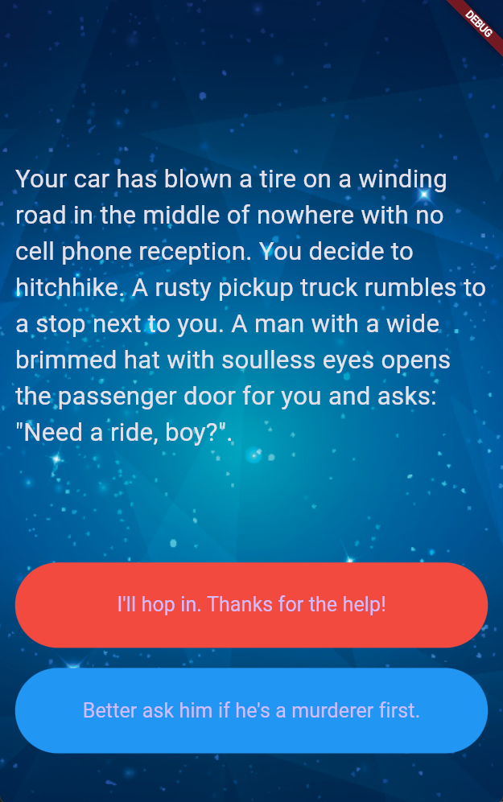

<h1 align="center">📖 Destini 📖</h1>

<p align="center">
  A "Choose Your Own Adventure" Flutter app that tests the boundaries of OOP and App Structure!
</p>

<div align="center">
  
  
</div>

---

## 📖 Table of Contents
- [The Story Behind This Project](#-the-story-behind-this-project)
- [Screenshots](#-screenshots)
- [Key Features](#-key-features)
- [What I Learned](#-what-i-learned)
- [Tech Stack](#-tech-stack)
- [Installation and Usage](#-installation-and-usage)
- [File Structure](#-file-structure)
- [Contribution](#-contribution)
- [Acknowledgments](#-acknowledgments)
- [License](#-license)
- [Author](#-author)

---

## 📜 The Story Behind This Project

This project was built as a challenge module during the Flutter course. It served as a practical test to reinforce the **Structuring Flutter Apps** concepts learned during the "Quizzler" module. The goal was to build a "Choose Your Own Adventure" story app from scratch, putting my knowledge of Object-Oriented Programming (OOP), custom Dart classes, and UI separation to the test.

It was an excellent way to independently solidify how to manage complex state transitions and model data structures.

If you think it turned out cool, feel free to drop a **star ⭐** or **fork it 🍴**!

---

## 🖥️ Screenshots

<div align="center">
  <table>
    <tr>
      <td align="center">
        
        <br/>
        <em>App Screen (Destini)</em>
      </td>
    </tr>
  </table>
</div>

---

## 📌 Key Features

- 📖 **Interactive Story:** Make choices that branch the narrative and lead to different endings!
- 🏗️ **Clean Architecture:** Uses Object-Oriented Principles (OOP) to cleanly separate the story bank logic from the UI.
- 🔄 **Dynamic UI:** Real-time interface updates utilizing Flutter's stateful widgets based on your choices.
- 📱 **Responsive Layout:** Built with layout widgets ensuring a consistent, beautiful experience on any device screen.

---

## 🧠 What I Learned (Structuring Flutter Apps)

During this part of my development journey, I gained practical experience with the following:

- **Dart Fundamentals:** Learn about how lists and conditionals work in Dart.
- **Classes & Objects:** Learn about classes and objects in Dart and how they apply to Flutter widgets.
- **Object-Oriented Programming:** Understand Object-Oriented Dart and how to apply the fundamentals of OOP to restructuring a Flutter app.
- **Dart Constructors:** Learn to use Dart Constructors to create customisable Flutter widgets.
- **Design Patterns:** Apply common mobile design patterns to structure Flutter apps.
- **App Organization:** Learn about structuring and organising Flutter apps cleanly.

---

## 🛠️ Tech Stack

- **Framework:** Flutter
- **Language:** Dart

---

## 🚀 Installation and Usage

To run this project locally, ensure you have Flutter installed on your machine.

### **1. Clone the Repository**
```sh
git clone https://github.com/Dibyaranjan27/flutter-course-projects.git
```

### **2. Navigate to Project**
```sh
cd "flutter-course-projects/ destini_challenge_flutter"
```
*(Note: There is a leading space in the folder name, so ensure you include the quotes!)*

### **3. Fetch Dependencies**
```sh
flutter pub get
```

### **4. Run the App**
Connect a device or start an emulator, then run:
```sh
flutter run
```

---

## 📂 File Structure

```text
/destini_challenge_flutter
│
├── android/                # Android-specific files
├── ios/                    # iOS-specific files
├── lib/                    # Dart code
│   ├── main.dart           # Main entry point and UI logic
│   ├── story.dart          # Story model class
│   └── story_brain.dart    # OOP class handling the story branches
├── images/                 # Image assets (e.g., background.png)
├── pubspec.yaml            # Flutter project dependencies and assets
└── README.md               # This file
```

---

## 🤝 Contribution

Feel free to contribute to this project! Fork the repository, make your improvements, and submit a pull request. All contributions are welcome.

If you have any questions or suggestions, feel free to contact me. I'd be happy to help! 😊

---

## ⭐ Acknowledgments

Thanks to Angela Yu and The London App Brewery for the incredible Flutter course!
If you find this repository helpful, consider starring ⭐ it on GitHub!

---

## 📜 License

This project is open-source and available under the MIT License.

---

## 💡 Author

<p align="center">
<em>Crafted with pixels & passion by</em>
<br>
<strong>Dibyaranjan Maharana</strong>
<br>
<a href="https://github.com/Dibyaranjan27">GitHub</a> | <a href="https://www.linkedin.com/in/dibyaranjan-maharana-1228012b2/">LinkedIn</a>
</p>
