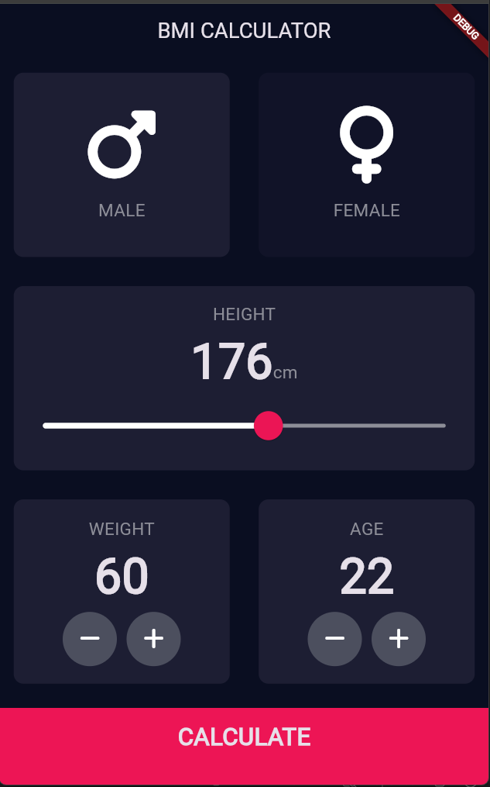
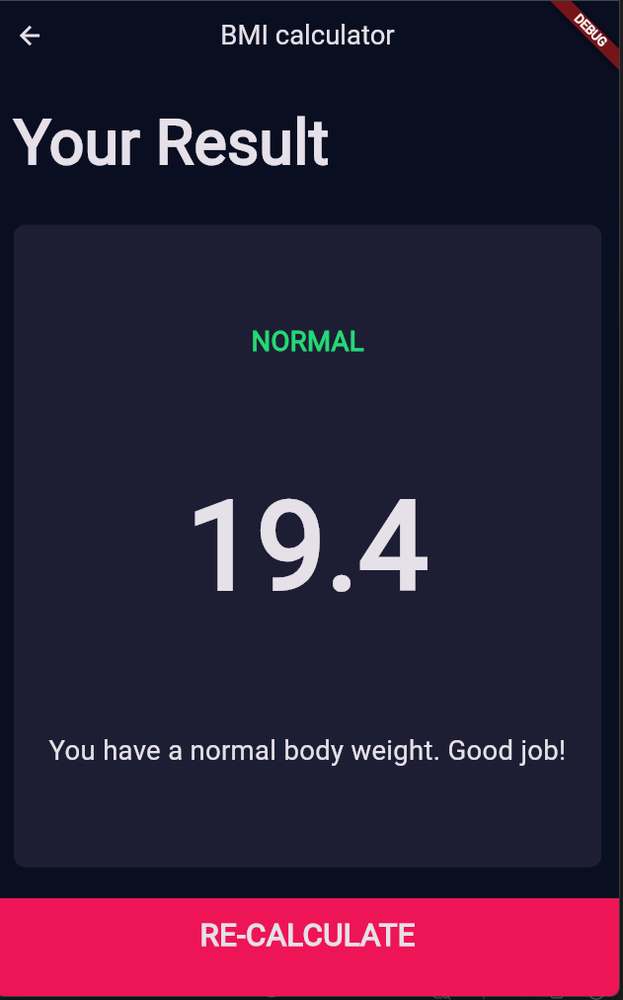

<h1 align="center">⚖️ BMI Calculator ⚖️</h1>

<p align="center">
  A multi-screen Flutter application customized with themes to calculate Body Mass Index!
</p>

<div align="center">
  
  
</div>

---

## 📖 Table of Contents
- [The Story Behind This Project](#-the-story-behind-this-project)
- [Screenshots](#-screenshots)
- [Key Features](#-key-features)
- [What I Learned](#-what-i-learned)
- [Tech Stack](#-tech-stack)
- [Installation and Usage](#-installation-and-usage)
- [File Structure](#-file-structure)
- [Contribution](#-contribution)
- [Acknowledgments](#-acknowledgments)
- [License](#-license)
- [Author](#-author)

---

## 📜 The Story Behind This Project

This project was built as part of the Flutter course, focusing on **Creating Beautiful UI with Flutter for Intermediates**. The goal was to step up the UI game by building a multi-screen application (a BMI Calculator) that uses custom themes, extracts reusable widget classes, and navigates seamlessly between screens.

It was an excellent deep dive into Dart's more advanced features (like enums and first-class functions) while truly understanding how Flutter favors composition over inheritance.

If you think it turned out cool, feel free to drop a **star ⭐** or **fork it 🍴**!

---

## 🖥️ Screenshots

<div align="center">
  <table>
    <tr>
      <td align="center">
        <!-- Add your screenshot to an 'images' folder and update this path! -->
        
        <br/>
        <em>App Calculator Screen (BMI Calculator)</em>
      </td>
      <td align="center">
        <!-- Add your screenshot to an 'images' folder and update this path! -->
        
        <br/>
        <em>App Result Screen (BMI Calculator)</em>
      </td>
    </tr>
  </table>
</div>

---

## 📌 Key Features

- ⚖️ **BMI Calculation:** Input your height, weight, age, and gender to accurately calculate your BMI.
- 🎨 **Custom Themes:** A beautifully styled, dark-themed UI built using customized `ThemeData`.
- 🔀 **Multi-Screen Navigation:** Uses Flutter's `Navigator` to seamlessly transition between the input screen and the results screen.
- 🧩 **Custom Widgets:** Highly modular codebase where complex UI elements are built by composing smaller, reusable widgets.

---

## 🧠 What I Learned (Creating Beautiful UI for Intermediates)

During this part of my development journey, I gained practical experience with the following:

- **Theming:** Customise apps with `Theme` widgets.
- **Widget Refactoring:** Refactoring widgets by extracting them as separate Widget classes.
- **Dart Modifiers:** Learn about Dart annotations and modifiers (e.g., the difference between `final` and `const`).
- **Immutability:** Understand the immutability of Stateless and Stateful Widgets and how the screen is updated with the `build()` method.
- **Composition vs Inheritance:** Create custom Flutter Widgets by combining smaller widgets, and understand why Flutter favors composition vs. inheritance when customising widgets.
- **Advanced Dart Types:** Learn about maps, enums, and the ternary operator in Dart.
- **First-Class Functions:** Understand that functions are first-class objects in Dart and how functions can be passed around as arguments.
- **Navigation:** Learn to build multi-screen Flutter apps by learning about routes and the `Navigator` widget.

---

## 🛠️ Tech Stack

- **Framework:** Flutter
- **Language:** Dart

---

## 🚀 Installation and Usage

To run this project locally, ensure you have Flutter installed on your machine.

### **1. Clone the Repository**
```sh
git clone https://github.com/Dibyaranjan27/flutter-course-projects.git
```

### **2. Navigate to Project**
```sh
cd flutter-course-projects/bmi_calculator_flutter
```

### **3. Fetch Dependencies**
```sh
flutter pub get
```

### **4. Run the App**
Connect a device or start an emulator, then run:
```sh
flutter run
```

---

## 📂 File Structure

```text
/bmi_calculator_flutter
│
├── android/                # Android-specific files
├── ios/                    # iOS-specific files
├── lib/                    # Dart code
│   ├── main.dart           # Main entry point and theme setup
│   └── screens/            # UI screens (e.g., input page, results page)
├── pubspec.yaml            # Flutter project dependencies and assets
└── README.md               # This file
```

---

## 🤝 Contribution

Feel free to contribute to this project! Fork the repository, make your improvements, and submit a pull request. All contributions are welcome.

If you have any questions or suggestions, feel free to contact me. I'd be happy to help! 😊

---

## ⭐ Acknowledgments

Thanks to Angela Yu and The London App Brewery for the incredible Flutter course!
If you find this repository helpful, consider starring ⭐ it on GitHub!

---

## 📜 License

This project is open-source and available under the MIT License.

---

## 💡 Author

<p align="center">
<em>Crafted with pixels & passion by</em>
<br>
<strong>Dibyaranjan Maharana</strong>
<br>
<a href="https://github.com/Dibyaranjan27">GitHub</a> | <a href="https://www.linkedin.com/in/dibyaranjan-maharana-1228012b2/">LinkedIn</a>
</p>
