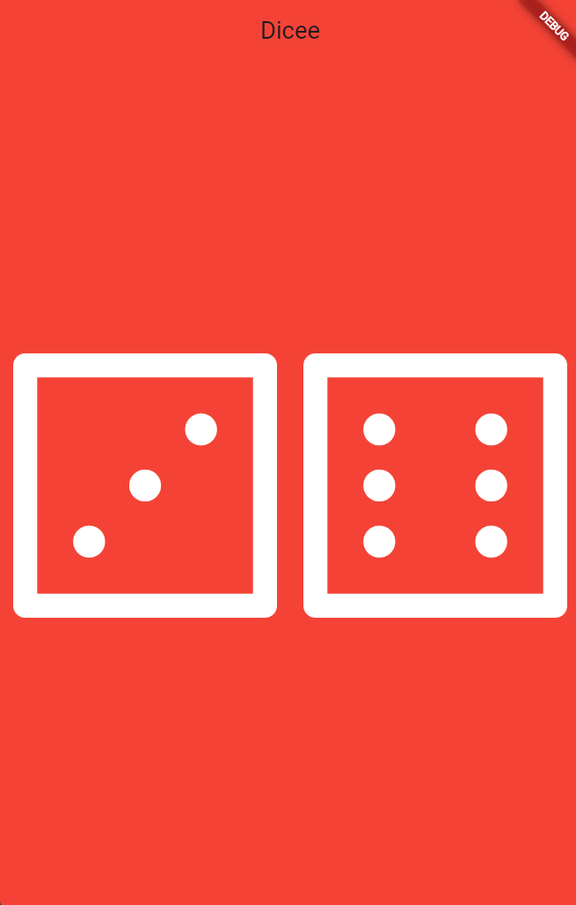

<h1 align="center">🎲 Dicee 🎲</h1>

<p align="center">
  A fun and interactive Flutter dice app that brings chance to your fingertips!
</p>

<div align="center">
  
  
</div>

---

## 📖 Table of Contents
- [The Story Behind This Project](#-the-story-behind-this-project)
- [Screenshots](#-screenshots)
- [Key Features](#-key-features)
- [What I Learned](#-what-i-learned)
- [Tech Stack](#-tech-stack)
- [Installation and Usage](#-installation-and-usage)
- [File Structure](#-file-structure)
- [Contribution](#-contribution)
- [Acknowledgments](#-acknowledgments)
- [License](#-license)
- [Author](#-author)

---

## 📜 The Story Behind This Project

This project was built as part of the Flutter course. It’s a classic digital dice roller that introduces state management to Flutter apps. The goal was to move beyond static screens and build an application that responds to user input (tapping the dice) and updates the UI dynamically.

It was a fantastic introduction to making apps interactive and seeing how changes in state instantly reflect on the screen.

If you think it turned out cool, feel free to drop a **star ⭐** or **fork it 🍴**!

---

## 🖥️ Screenshots

<div align="center">
  <table>
    <tr>
      <td align="center">
        
        <br/>
        <em>App Screen (Dice)</em>
      </td>
    </tr>
  </table>
</div>

---

## 📌 Key Features

- 🎲 **Interactive Dice:** Tap on either dice to roll them and get a random combination!
- 🔄 **Dynamic UI:** Real-time interface updates utilizing Flutter's stateful widgets.
- 📱 **Flexible Layout:** Built with `Expanded` widgets to ensure a consistent, beautiful layout on any device screen.
- 🎨 **Material Design:** A clean, bold aesthetic built on the `MaterialApp` framework.

---

## 🧠 What I Learned (Building Apps with State)

During this part of my development journey, I gained practical experience with the following:

- **Stateful vs Stateless:** Understand the difference between Stateful and Stateless Widgets and when they should each be used.
- **Interactivity:** Understand how callbacks can be used to detect user interaction in button widgets.
- **Declarative UI:** Understand the declarative style of UI programming and how Flutter widgets react to state changes.
- **Libraries:** Learn to import dart libraries to incorporate additional functionality (like math randomizers).
- **Dart Fundamentals:** Learn about how variables, data types, and functions work in Dart 2.
- **Responsive Design:** Build flexible layouts using the Flutter `Expanded` widget.
- **State Management:** Understand the relationship between `setState()`, State objects, and Stateful Widgets.

---

## 🛠️ Tech Stack

- **Framework:** Flutter
- **Language:** Dart

---

## 🚀 Installation and Usage

To run this project locally, ensure you have Flutter installed on your machine.

### **1. Clone the Repository**
```sh
git clone https://github.com/Dibyaranjan27/flutter-course-projects.git
```

### **2. Navigate to Project**
```sh
cd flutter-course-projects/dicee_flutter
```

### **3. Fetch Dependencies**
```sh
flutter pub get
```

### **4. Run the App**
Connect a device or start an emulator, then run:
```sh
flutter run
```

---

## 📂 File Structure

```text
/dicee_flutter
│
├── android/                # Android-specific files
├── ios/                    # iOS-specific files
├── lib/                    # Dart code
│   └── main.dart           # Main entry point for the app
├── images/                 # Image assets (e.g., dice1.png)
├── pubspec.yaml            # Flutter project dependencies and assets
└── README.md               # This file
```

---

## 🤝 Contribution

Feel free to contribute to this project! Fork the repository, make your improvements, and submit a pull request. All contributions are welcome.

If you have any questions or suggestions, feel free to contact me. I'd be happy to help! 😊

---

## ⭐ Acknowledgments

Thanks to Angela Yu and The London App Brewery for the incredible Flutter course!
If you find this repository helpful, consider starring ⭐ it on GitHub!

---

## 📜 License

This project is open-source and available under the MIT License.

---

## 💡 Author

<p align="center">
<em>Crafted with pixels & passion by</em>
<br>
<strong>Dibyaranjan Maharana</strong>
<br>
<a href="https://github.com/Dibyaranjan27">GitHub</a> | <a href="https://www.linkedin.com/in/dibyaranjan-maharana-1228012b2/">LinkedIn</a>
</p>
