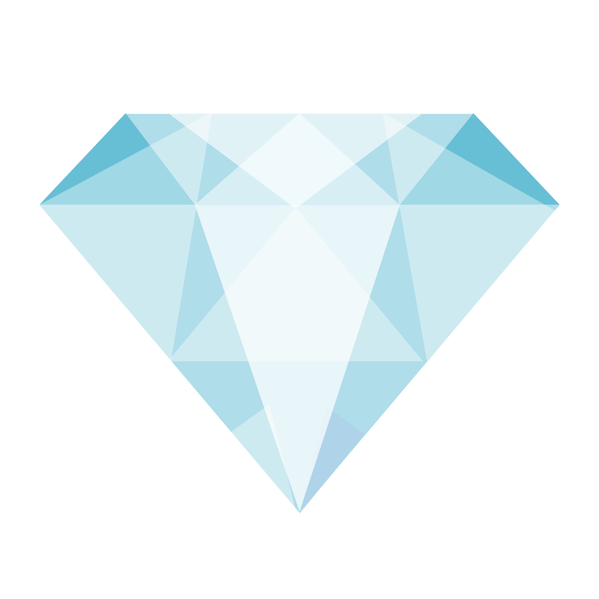

<h1 align="center">💎 I Am Rich 💎</h1>

<p align="center">
  A simple, yet elegant Flutter application demonstrating basic widget usage and app structure.
</p>

<div align="center">
  
  
</div>

---

## 📖 Table of Contents
- [The Story Behind This Project](#-the-story-behind-this-project)
- [Screenshots](#-screenshots)
- [Key Features](#-key-features)
- [Tech Stack](#-tech-stack)
- [Installation and Usage](#-installation-and-usage)
- [File Structure](#-file-structure)
- [Contribution](#-contribution)
- [Acknowledgments](#-acknowledgments)
- [License](#-license)
- [Author](#-author)

---

## 📜 The Story Behind This Project

This project was built as part of the Flutter course I completed. It is a classic introductory app known as "I Am Rich". The primary goal was to learn the absolute fundamentals of Flutter development. This included setting up the environment, understanding the widget tree, working with foundational widgets like `MaterialApp`, `Scaffold`, and `AppBar`, and most importantly, learning how to incorporate and display local image assets.

It was a great exercise in taking a basic concept and successfully deploying it to a device.

If you think it turned out cool, feel free to drop a **star ⭐** or **fork it 🍴**!

---

## 🖥️ Screenshots

<div align="center">
  <table>
    <tr>
      <td align="center">
        
        <br/>
        <em>App Screen (The Diamond)</em>
      </td>
    </tr>
  </table>
</div>

---

## 📌 Key Features

- 💎 **Elegant Display:** A clean, centered display of a beautiful diamond.
- 📱 **Responsive UI:** Built with Flutter's basic layout widgets ensuring it adapts to the screen constraints.
- 🎨 **Material Design:** Utilizes the `MaterialApp` framework for a polished Android/iOS look.

---

## 🛠️ Tech Stack

- **Framework:** Flutter
- **Language:** Dart

---

## 🚀 Installation and Usage

To run this project locally, ensure you have Flutter installed on your machine.

### **1. Clone the Repository**
```sh
git clone https://github.com/Dibyaranjan27/i_am_rich.git
cd i_am_rich
```

### **2. Fetch Dependencies**
```sh
flutter pub get
```

### **3. Run the App**
Connect a device or start an emulator, then run:
```sh
flutter run
```

---

## 📂 File Structure

```text
/i_am_rich
│
├── android/                # Android-specific files
├── ios/                    # iOS-specific files
├── lib/                    # Dart code
│   └── main.dart           # Main entry point for the app
├── images/                 # Image assets (e.g., diamond.png)
├── pubspec.yaml            # Flutter project dependencies and assets
└── README.md               # This file
```

---

## 🤝 Contribution

Feel free to contribute to this project! Fork the repository, make your improvements, and submit a pull request. All contributions are welcome.

If you have any questions or suggestions, feel free to contact me. I'd be happy to help! 😊

---

## ⭐ Acknowledgments

Thanks to Angela Yu and The London App Brewery for the incredible Flutter course!
If you find this repository helpful, consider starring ⭐ it on GitHub!

---

## 📜 License

This project is open-source and available under the MIT License.

---

## 💡 Author

<p align="center">
<em>Crafted with pixels & passion by</em>
<br>
<strong>Dibyaranjan Maharana</strong>
<br>
<a href="https://github.com/Dibyaranjan27">GitHub</a> | <a href="https://www.linkedin.com/in/dibyaranjan-maharana-1228012b2/">LinkedIn</a>
</p>
