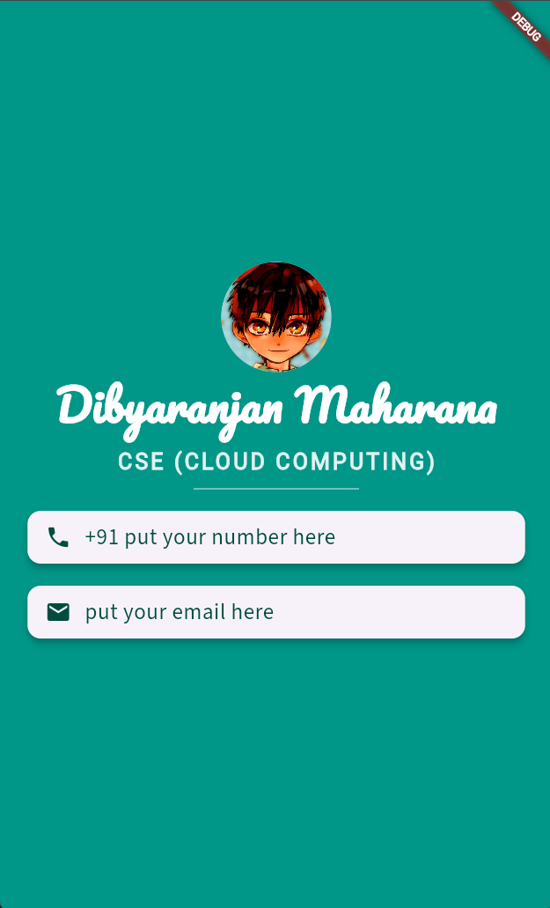

<h1 align="center">📇 Mi Card 📇</h1>

<p align="center">
  A beautiful, personalized digital business card application built with Flutter.
</p>

<div align="center">
  
  
</div>

---

## 📖 Table of Contents
- [The Story Behind This Project](#-the-story-behind-this-project)
- [Screenshots](#-screenshots)
- [Key Features](#-key-features)
- [What I Learned](#-what-i-learned)
- [Tech Stack](#-tech-stack)
- [Installation and Usage](#-installation-and-usage)
- [File Structure](#-file-structure)
- [Contribution](#-contribution)
- [Acknowledgments](#-acknowledgments)
- [License](#-license)
- [Author](#-author)

---

## 📜 The Story Behind This Project

This project was built as part of the Flutter course. The goal was to create a digital business card, allowing me to dive deeper into Flutter's layout widgets like `Column`, `Row`, and `Container`. 

It was a great exercise in taking a basic concept, styling UI elements (like adding custom fonts and icons), and successfully deploying a clean, responsive layout to a device.

If you think it turned out cool, feel free to drop a **star ⭐** or **fork it 🍴**!

---

## 🖥️ Screenshots

<div align="center">
  <table>
    <tr>
      <td align="center">
        
        <br/>
        <em>App Screen (Mi Card)</em>
      </td>
    </tr>
  </table>
</div>

---

## 📌 Key Features

- 📇 **Personalized Profile:** A clean, centered layout featuring a profile image, name, and role.
- ✉️ **Contact Information:** Stylishly displays contact details (phone number, email) using pre-made Flutter widgets.
- 🎨 **Custom Assets:** Utilizes custom local fonts and image assets to elevate the visual design.
- 📱 **Responsive UI:** Built with Flutter's basic layout widgets ensuring it adapts nicely to the screen.

---

## 🧠 What I Learned

During this part of my development journey, I gained practical experience with the following:

- **Setup & Environment:** Learn to set up a new Flutter project using Android Studio.
- **Widget Tree Mastery:** Understand the Widget tree and learn to use pre-made Flutter Widgets for user interface design.
- **Basic UI Components:** Learn to incorporate Image and Text Widgets to create simple user interfaces.
- **App Styling:** Learn to incorporate App Icons for iOS and Android.
- **Asset Management:** Learn how to add and load image assets to Flutter projects.
- **Deployment:** Run Flutter apps on iOS Simulator, Android Emulator, and physical devices.

---

## 🛠️ Tech Stack

- **Framework:** Flutter
- **Language:** Dart

---

## 🚀 Installation and Usage

To run this project locally, ensure you have Flutter installed on your machine.

### **1. Clone the Repository**
```sh
git clone https://github.com/Dibyaranjan27/flutter-course-projects.git
```

### **2. Navigate to Project**
```sh
cd flutter-course-projects/mi_card_flutter
```

### **3. Fetch Dependencies**
```sh
flutter pub get
```

### **4. Run the App**
Connect a device or start an emulator, then run:
```sh
flutter run
```

---

## 📂 File Structure

```text
/mi_card_flutter
│
├── android/                # Android-specific files
├── ios/                    # iOS-specific files
├── lib/                    # Dart code
│   └── main.dart           # Main entry point for the app
├── fonts/                  # Custom font files
├── images/                 # Image assets (e.g., amane.jpg)
├── pubspec.yaml            # Flutter project dependencies and assets
└── README.md               # This file
```

---

## 🤝 Contribution

Feel free to contribute to this project! Fork the repository, make your improvements, and submit a pull request. All contributions are welcome.

If you have any questions or suggestions, feel free to contact me. I'd be happy to help! 😊

---

## ⭐ Acknowledgments

Thanks to Angela Yu and The London App Brewery for the incredible Flutter course!
If you find this repository helpful, consider starring ⭐ it on GitHub!

---

## 📜 License

This project is open-source and available under the MIT License.

---

## 💡 Author

<p align="center">
<em>Crafted with pixels & passion by</em>
<br>
<strong>Dibyaranjan Maharana</strong>
<br>
<a href="https://github.com/Dibyaranjan27">GitHub</a> | <a href="https://www.linkedin.com/in/dibyaranjan-maharana-1228012b2/">LinkedIn</a>
</p>
