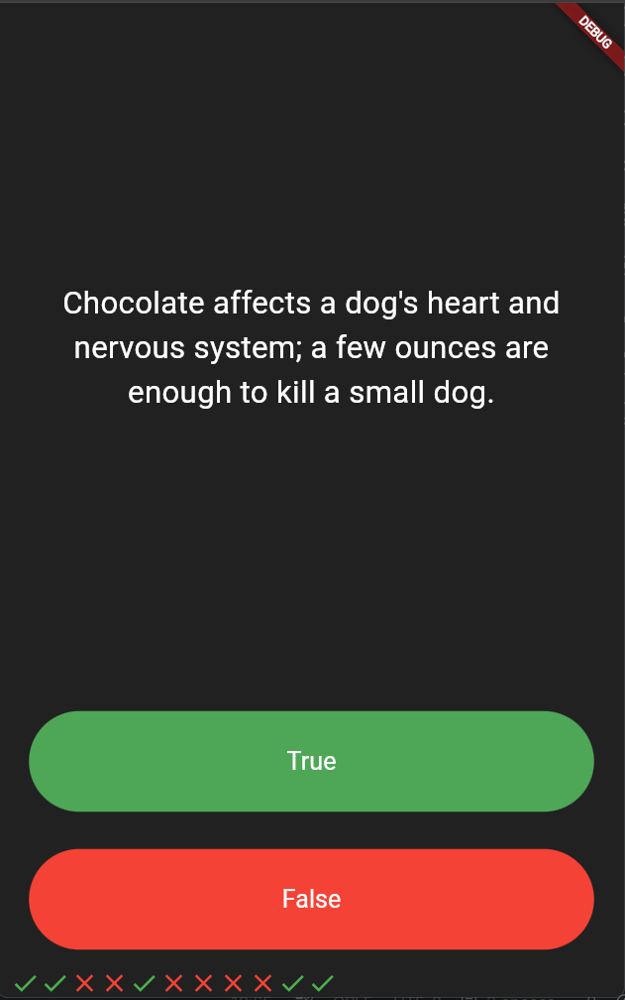

<h1 align="center">🧠 Quizzler 🧠</h1>

<p align="center">
  A fun, interactive quiz application built with Flutter to test your knowledge!
</p>

<div align="center">
  
  
</div>

---

## 📖 Table of Contents
- [The Story Behind This Project](#-the-story-behind-this-project)
- [Screenshots](#-screenshots)
- [Key Features](#-key-features)
- [What I Learned](#-what-i-learned)
- [Tech Stack](#-tech-stack)
- [Installation and Usage](#-installation-and-usage)
- [File Structure](#-file-structure)
- [Contribution](#-contribution)
- [Acknowledgments](#-acknowledgments)
- [License](#-license)
- [Author](#-author)

---

## 📜 The Story Behind This Project

This project was built as part of the Flutter course. It’s a true-or-false quiz app that keeps track of the user's score. The primary goal of this module was to focus on **Structuring Flutter Apps** by diving into Object-Oriented Programming (OOP) in Dart.

It was an incredible exercise in learning how to separate UI from the underlying business logic, creating custom classes, and keeping the codebase clean, scalable, and easy to maintain.

If you think it turned out cool, feel free to drop a **star ⭐** or **fork it 🍴**!

---

## 🖥️ Screenshots

<div align="center">
  <table>
    <tr>
      <td align="center">
        <!-- Add your screenshot to an 'images' folder and update this path! -->
        
        <br/>
        <em>App Screen (Quizzler)</em>
      </td>
    </tr>
  </table>
</div>

---

## 📌 Key Features

- 🧠 **Interactive Quiz:** Answer true or false questions to test your knowledge!
- ✅ **Score Tracking:** Displays a visual scorekeeper at the bottom using interactive icons.
- 🏗️ **Clean Architecture:** Uses Object-Oriented Principles (OOP) to cleanly separate the question bank logic from the UI.
- 📱 **Responsive Layout:** Built with `Expanded` widgets to ensure a consistent, beautiful layout on any device screen.

---

## 🧠 What I Learned (Structuring Flutter Apps)

During this part of my development journey, I gained practical experience with the following:

- **Dart Fundamentals:** Learn about how lists and conditionals work in Dart.
- **Classes & Objects:** Learn about classes and objects in Dart and how they apply to Flutter widgets.
- **Object-Oriented Programming:** Understand Object-Oriented Dart and how to apply the fundamentals of OOP to restructuring a Flutter app.
- **Dart Constructors:** Learn to use Dart Constructors to create customisable Flutter widgets.
- **Design Patterns:** Apply common mobile design patterns to structure Flutter apps.
- **App Organization:** Learn about structuring and organising Flutter apps cleanly.

---

## 🛠️ Tech Stack

- **Framework:** Flutter
- **Language:** Dart

---

## 🚀 Installation and Usage

To run this project locally, ensure you have Flutter installed on your machine.

### **1. Clone the Repository**
```sh
git clone https://github.com/Dibyaranjan27/flutter-course-projects.git
```

### **2. Navigate to Project**
```sh
cd flutter-course-projects/quizzler_flutter
```

### **3. Fetch Dependencies**
```sh
flutter pub get
```

### **4. Run the App**
Connect a device or start an emulator, then run:
```sh
flutter run
```

---

## 📂 File Structure

```text
/quizzler_flutter
│
├── android/                # Android-specific files
├── ios/                    # iOS-specific files
├── lib/                    # Dart code
│   ├── main.dart           # Main entry point and UI logic
│   ├── question.dart       # Question model class
│   └── quiz_brain.dart     # OOP class handling the question bank logic
├── pubspec.yaml            # Flutter project dependencies and assets
└── README.md               # This file
```

---

## 🤝 Contribution

Feel free to contribute to this project! Fork the repository, make your improvements, and submit a pull request. All contributions are welcome.

If you have any questions or suggestions, feel free to contact me. I'd be happy to help! 😊

---

## ⭐ Acknowledgments

Thanks to Angela Yu and The London App Brewery for the incredible Flutter course!
If you find this repository helpful, consider starring ⭐ it on GitHub!

---

## 📜 License

This project is open-source and available under the MIT License.

---

## 💡 Author

<p align="center">
<em>Crafted with pixels & passion by</em>
<br>
<strong>Dibyaranjan Maharana</strong>
<br>
<a href="https://github.com/Dibyaranjan27">GitHub</a> | <a href="https://www.linkedin.com/in/dibyaranjan-maharana-1228012b2/">LinkedIn</a>
</p>
