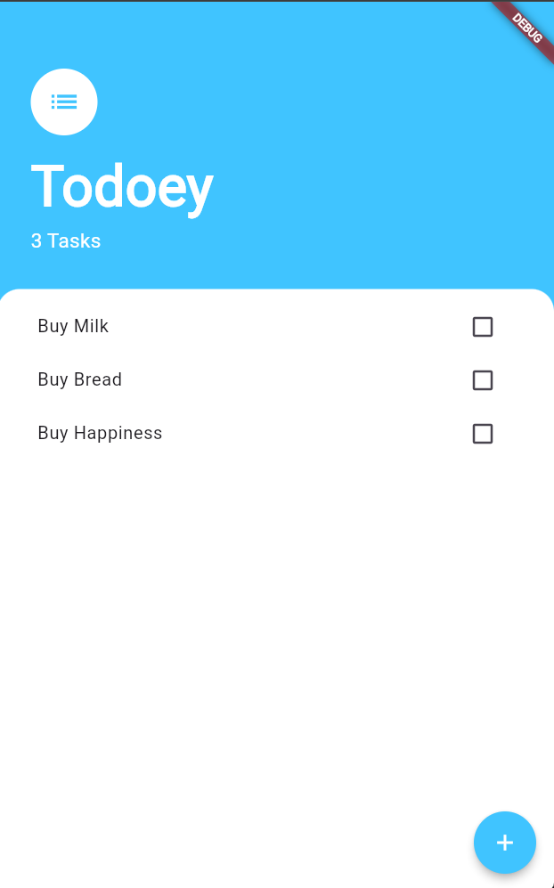

<h1 align="center">✅ Todoey ✅</h1>

<p align="center">
  A beautiful to-do list app focused on State Management and Architecture!
</p>

<div align="center">
  
  
  
</div>

---

## 📖 Table of Contents
- [The Story Behind This Project](#-the-story-behind-this-project)
- [Screenshots](#-screenshots)
- [Key Features](#-key-features)
- [What I Learned](#-what-i-learned)
- [Tech Stack](#-tech-stack)
- [Installation and Usage](#-installation-and-usage)
- [File Structure](#-file-structure)
- [Contribution](#-contribution)
- [Acknowledgments](#-acknowledgments)
- [License](#-license)
- [Author](#-author)

---

## 📜 The Story Behind This Project

This project was built as part of the Flutter course, focusing deeply on **State Management**. As Flutter applications grow, relying purely on `setState()` and passing callbacks up and down the widget tree (prop drilling) becomes messy and difficult to maintain.

Todoey is a simple to-do list application, but under the hood, it's designed to solve these architectural problems. By adopting the Google-recommended `provider` package, the app elegantly manages its state, separates UI from business logic, and keeps the widget tree completely decoupled.

If you think it turned out cool, feel free to drop a **star ⭐** or **fork it 🍴**!

---

## 🖥️ Screenshots

<div align="center">
  <table>
    <tr>
      <td align="center">
        <!-- Add your screenshot to an 'images' folder and update this path! -->
        
        <br/>
        <em>App Screen (Todoey)</em>
      </td>
    </tr>
  </table>
</div>

---

## 📌 Key Features

- 📝 **Task Management:** Add new tasks, check them off as completed, and seamlessly view your progress.
- ⬆️ **Bottom Sheet UI:** A smooth, slide-up `BottomSheet` interface for adding new to-do items effortlessly.
- 📦 **Centralized State:** Task data is managed at the top of the widget tree and broadcasted down to listeners using `Provider`.
- ⚡ **Optimized Rendering:** Only the specific widgets that rely on the task data are rebuilt when a change occurs, avoiding unnecessary whole-screen rebuilds.

---

## 🧠 What I Learned (State Management)

During this part of my development journey, I gained practical experience with the following architectural concepts:

- **State Management:** Understand why we need to manage state across our widget tree and how it prevents "spaghetti code."
- **Programming Paradigms:** Learn about the differences between declarative vs. imperative programming.
- **Under the Hood:** Look at exactly how `setState()` works and when it falls short.
- **Prop Drilling:** Learn about the pains of prop drilling and how to solve it by "lifting state up."
- **UI Components:** Learn to use the `BottomSheet` widget and dynamically render lists using the `ListView.builder`.
- **Architecture:** Understand core Flutter app architecture design patterns.
- **Provider Package:** Learn to manage state cleanly and efficiently with the Google-recommended `provider` package.

---

## 🛠️ Tech Stack

- **Framework:** Flutter
- **Language:** Dart
- **Key Packages:** `provider`

---

## 🚀 Installation and Usage

To run this project locally, ensure you have Flutter installed on your machine.

### **1. Clone the Repository**
```sh
git clone https://github.com/Dibyaranjan27/flutter-course-projects.git
```

### **2. Navigate to Project**
```sh
cd flutter-course-projects/todoey_flutter
```

### **3. Fetch Dependencies**
```sh
flutter pub get
```

### **4. Run the App**
Connect a device or start an emulator, then run:
```sh
flutter run
```

---

## 📂 File Structure

```text
/todoey_flutter
│
├── android/                # Android-specific files
├── ios/                    # iOS-specific files
├── lib/                    # Dart code
│   ├── main.dart           # App entry point (Provider initialized here)
│   ├── models/             # Business logic and data models (Task, TaskData)
│   ├── screens/            # UI screens (TasksScreen, AddTaskScreen)
│   └── widgets/            # Reusable UI components (TaskTile, TasksList)
├── pubspec.yaml            # Flutter project dependencies and assets
└── README.md               # This file
```

---

## 🤝 Contribution

Feel free to contribute to this project! Fork the repository, make your improvements, and submit a pull request. All contributions are welcome.

If you have any questions or suggestions, feel free to contact me. I'd be happy to help! 😊

---

## ⭐ Acknowledgments

Thanks to Angela Yu and The London App Brewery for the incredible Flutter course!
If you find this repository helpful, consider starring ⭐ it on GitHub!

---

## 📜 License

This project is open-source and available under the MIT License.

---

## 💡 Author

<p align="center">
<em>Crafted with pixels & passion by</em>
<br>
<strong>Dibyaranjan Maharana</strong>
<br>
<a href="https://github.com/Dibyaranjan27">GitHub</a> | <a href="https://www.linkedin.com/in/dibyaranjan-maharana-1228012b2/">LinkedIn</a>
</p>
