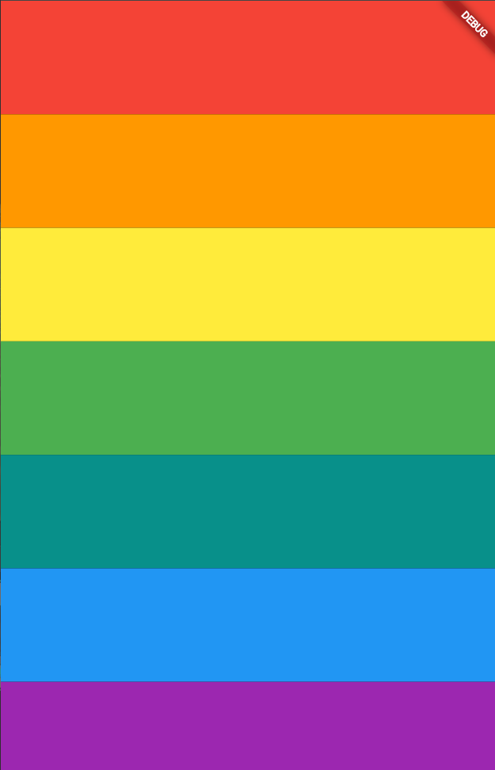

<h1 align="center">🎹 Xylophone 🎹</h1>

<p align="center">
  A colorful, interactive Flutter app that plays musical notes, introducing audio playback and packages!
</p>

<div align="center">
  
  
</div>

---

## 📖 Table of Contents
- [The Story Behind This Project](#-the-story-behind-this-project)
- [Screenshots](#-screenshots)
- [Key Features](#-key-features)
- [What I Learned](#-what-i-learned)
- [Tech Stack](#-tech-stack)
- [Installation and Usage](#-installation-and-usage)
- [File Structure](#-file-structure)
- [Contribution](#-contribution)
- [Acknowledgments](#-acknowledgments)
- [License](#-license)
- [Author](#-author)

---

## 📜 The Story Behind This Project

This project was built as part of the Flutter course. It’s an interactive xylophone app with seven beautifully colored keys that play distinct musical notes when tapped. The primary goal of this module was to learn how to speed up development by leveraging external packages from pub.dev, specifically the `audioplayers` package.

It was a great exercise in playing audio assets, refactoring widgets to avoid code duplication, and understanding Flutter's philosophy of "UI as code".

If you think it turned out cool, feel free to drop a **star ⭐** or **fork it 🍴**!

---

## 🖥️ Screenshots

<div align="center">
  <table>
    <tr>
      <td align="center">
        <!-- Add your screenshot to an 'images' folder and update this path! -->
        
        <br/>
        <em>App Screen (Xylophone)</em>
      </td>
    </tr>
  </table>
</div>

---

## 📌 Key Features

- 🎹 **Musical Keys:** 7 colorful, interactive buttons that play real xylophone sounds.
- 🎵 **Audio Playback:** Seamlessly plays local `.wav` files using the `audioplayers` package.
- 🔄 **Refactored UI:** Code uses custom functions to dynamically generate buttons and reduce repetition.
- 📱 **Responsive Layout:** Built with `Expanded` widgets to ensure keys stretch perfectly across any device screen.

---

## 🧠 What I Learned (Leveraging Flutter Packages)

During this part of my development journey, I gained practical experience with the following:

- **Package Manager:** Learn to use the Dart package manager to incorporate Flutter compatible packages into your projects.
- **Dependencies:** Understanding the structure of the `pubspec.yaml` file.
- **Audio Playback:** Incorporate the `audioplayers` package to play sound.
- **Dart Functions:** Learn more about functions in Dart and the arrow syntax (`=>`).
- **Clean Architecture:** Learn to refactor widgets and understand Flutter's philosophy of UI as code.

---

## 🛠️ Tech Stack

- **Framework:** Flutter
- **Language:** Dart
- **Packages:** `audioplayers`

---

## 🚀 Installation and Usage

To run this project locally, ensure you have Flutter installed on your machine.

### **1. Clone the Repository**
```sh
git clone https://github.com/Dibyaranjan27/flutter-course-projects.git
```

### **2. Navigate to Project**
```sh
cd flutter-course-projects/xylophone_flutter
```

### **3. Fetch Dependencies**
```sh
flutter pub get
```

### **4. Run the App**
Connect a device or start an emulator, then run:
```sh
flutter run
```

---

## 📂 File Structure

```text
/xylophone_flutter
│
├── android/                # Android-specific files
├── ios/                    # iOS-specific files
├── lib/                    # Dart code
│   └── main.dart           # Main entry point for the app
├── assets/                 # Audio assets (e.g., note1.wav)
├── pubspec.yaml            # Flutter project dependencies and assets
└── README.md               # This file
```

---

## 🤝 Contribution

Feel free to contribute to this project! Fork the repository, make your improvements, and submit a pull request. All contributions are welcome.

If you have any questions or suggestions, feel free to contact me. I'd be happy to help! 😊

---

## ⭐ Acknowledgments

Thanks to Angela Yu and The London App Brewery for the incredible Flutter course!
If you find this repository helpful, consider starring ⭐ it on GitHub!

---

## 📜 License

This project is open-source and available under the MIT License.

---

## 💡 Author

<p align="center">
<em>Crafted with pixels & passion by</em>
<br>
<strong>Dibyaranjan Maharana</strong>
<br>
<a href="https://github.com/Dibyaranjan27">GitHub</a> | <a href="https://www.linkedin.com/in/dibyaranjan-maharana-1228012b2/">LinkedIn</a>
</p>
